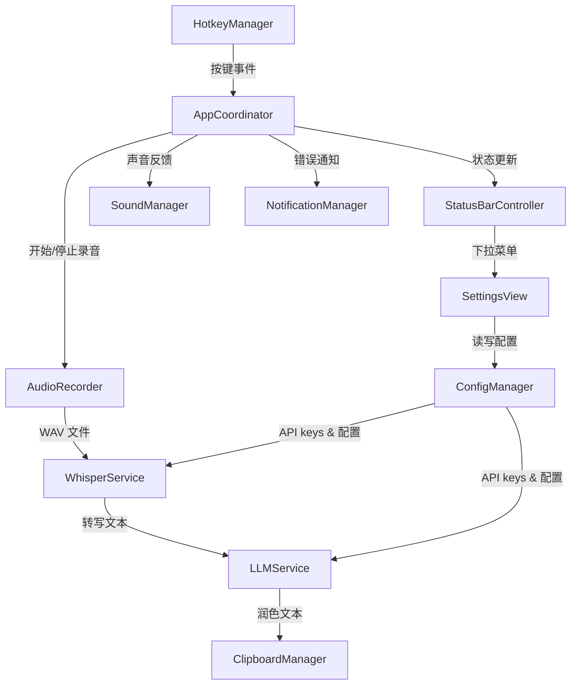
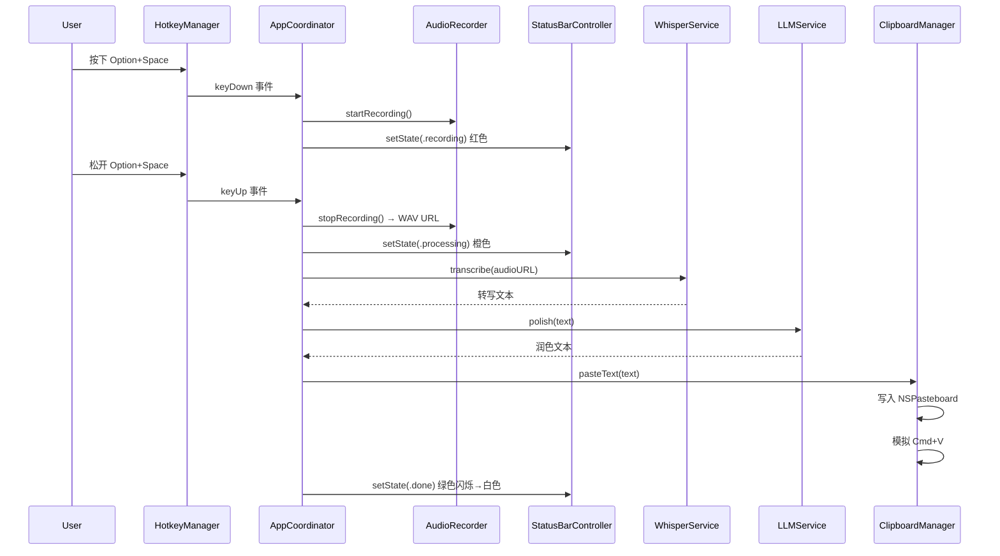

# 设计文档

## 概述

VoicePaste 是一个纯 macOS menu bar 应用，使用 Swift + SwiftUI 构建，通过 Swift Package Manager (SPM) 管理项目。应用的核心流程为：用户按住右 Option 键 → 录音 → 松开后自动调用本地 whisper.cpp 转写 → 调用可配置 LLM API 润色 → 写入剪贴板 → 自动粘贴。

整体架构采用单进程事件驱动模型，各组件通过 Swift 的 async/await 协调异步操作。应用不引入任何第三方依赖，仅使用 macOS 系统框架。语音转文字使用本地 whisper.cpp 模型，完全离线运行。

## 架构

### 整体架构图



### 处理流水线时序图



## 组件与接口

### 1. AppCoordinator（应用协调器）

应用的核心协调组件，管理整个处理流水线的生命周期。

```swift
@MainActor
class AppCoordinator: ObservableObject {
    @Published var lastPolishedText: String?
    @Published var appState: AppState = .idle
    
    enum AppState {
        case idle, recording, processing, done
    }
    
    func handleKeyDown()    // 开始录音
    func handleKeyUp()      // 停止录音，启动处理流水线
    
    // 内部流水线（async）
    private func runPipeline(audioURL: URL) async throws
}
```

### 2. HotkeyManager（全局快捷键管理）

使用 `CGEvent` tap 监听全局键盘事件，检测右 Option 键的按下和松开。

```swift
class HotkeyManager {
    var onKeyDown: (() -> Void)?
    var onKeyUp: (() -> Void)?
    
    func register()     // 注册全局事件监听
    func unregister()   // 注销监听
}
```

实现要点：
- 使用 `CGEvent.tapCreate` 创建事件 tap（`.listenOnly` 模式），监听 `.flagsChanged` 事件
- 检测右 Option 键（keyCode 61）的按下和松开
- 需要辅助功能权限（Accessibility）
- 包含 tap 超时自动恢复处理
- 事件 tap 需要添加到 RunLoop 中

### 3. AudioRecorder（音频录制）

使用 `AVAudioEngine` 录制麦克风音频，输出 WAV 格式文件。

```swift
class AudioRecorder {
    func startRecording() throws           // 开始录音
    func stopRecording() throws -> URL     // 停止录音，返回 WAV 文件路径
    var isRecording: Bool { get }
}
```

实现要点：
- 使用 `AVAudioEngine` 的 `inputNode` 获取麦克风输入
- 安装 tap on bus 捕获音频 buffer
- 使用 `AVAudioFile` 写入 WAV 格式到 `/tmp/voicepaste_recording.wav`
- 录音格式：硬件采样率, 单声道, float32 WAV（避免实时格式转换崩溃）

### 4. WhisperService（语音转文字服务）

调用本地 whisper.cpp（whisper-cli）进行语音转文字，完全离线运行，不需要 API key。

```swift
class WhisperService {
    private let whisperCLI = "/opt/homebrew/bin/whisper-cli"
    private let modelPath: String  // ~/.local/share/whisper-cpp/models/ggml-large-v3-turbo.bin
    
    func transcribe(audioURL: URL) async throws -> String
}
```

实现要点：
- 通过 `Process` 调用本地 `/opt/homebrew/bin/whisper-cli` 命令行工具
- 使用 `ggml-large-v3-turbo.bin` 模型（~1.5GB，支持中英混说）
- 模型路径：`~/.local/share/whisper-cpp/models/ggml-large-v3-turbo.bin`
- 参数：`-m <model> -l auto -f <audio> --no-timestamps --no-prints`
- 使用 `-l auto` 自动语言检测
- 已知局限：中英混说时以开头语言为主，交由 LLM 润色修正
- 不需要网络连接，不需要 API key

### 5. LLMService（LLM 润色服务）

调用可配置的 LLM API 进行文本润色，支持兼容 OpenAI Chat Completions 格式的 API。

```swift
protocol LLMProvider {
    var baseURL: String { get }
    var model: String { get }
    func buildRequest(apiKey: String, systemPrompt: String, userText: String) -> URLRequest
    func parseResponse(data: Data) throws -> String
}

class LLMService {
    func polish(text: String) async throws -> String
}
```

实现要点：
- 使用 OpenAI Chat Completions 兼容格式（DeepSeek、OpenAI 等均兼容）
- endpoint 由配置决定，默认 `https://api.deepseek.com/v1/chat/completions`
- 支持的提供商通过 `llm_provider` 配置字段选择
- 内置 system prompt 用于润色指令
- 设置 30 秒超时
- 解析 JSON 响应提取 `choices[0].message.content`

### 6. ConfigManager（配置管理）

读写 `~/.config/voicepaste/config.json` 配置文件。

```swift
struct AppConfig: Codable {
    var openaiApiKey: String?    // 可选 — 本地 Whisper 不需要
    var llmProvider: String      // "deepseek", "openai" 等
    var llmApiKey: String
    var llmModel: String?        // 可选，覆盖默认模型
    var llmBaseURL: String?      // 可选，自定义 API endpoint
    var hotkeyModifiers: UInt?   // 快捷键修饰键
    var hotkeyKeyCode: UInt?     // 快捷键键码
    var launchAtLogin: Bool?
}

class ConfigManager {
    static let shared: ConfigManager
    
    func load() throws -> AppConfig
    func save(_ config: AppConfig) throws
    var configFileURL: URL { get }
}
```

实现要点：
- 配置文件路径：`~/.config/voicepaste/config.json`
- 使用 `JSONEncoder`/`JSONDecoder` 进行序列化/反序列化
- 如果目录不存在，创建目录
- 如果文件不存在，返回明确错误

### 7. ClipboardManager（剪贴板管理）

将文本写入系统剪贴板并模拟粘贴。

```swift
class ClipboardManager {
    func copyToClipboard(_ text: String)    // 写入 NSPasteboard
    func simulatePaste()                     // 模拟 Cmd+V
    func pasteText(_ text: String)           // 复制 + 粘贴一步完成
}
```

实现要点：
- 使用 `NSPasteboard.general` 写入文本
- 使用 `CGEvent` 创建 Cmd+V 按键事件并 post
- 需要辅助功能权限
- 粘贴前添加短暂延迟（~100ms）确保剪贴板内容就绪

### 8. StatusBarController（状态栏控制器）

管理 menu bar 图标、颜色状态和下拉菜单。

```swift
@MainActor
class StatusBarController: ObservableObject {
    func setState(_ state: AppCoordinator.AppState)  // 更新图标颜色
    func setupMenuBarItem()                           // 初始化 menu bar
    func updateLastResult(_ text: String)             // 更新上次结果
}
```

实现要点：
- 使用 `NSStatusBar.system.statusItem` 创建 menu bar 项
- 使用 SF Symbols `mic.fill` 作为图标
- 颜色映射：idle→白色, recording→红色, processing→橙色, done→绿色
- 绿色状态持续 0.5 秒后恢复白色
- 下拉菜单使用 `NSMenu` 构建

### 9. SettingsView（设置界面）

SwiftUI 设置窗口。

```swift
struct SettingsView: View {
    // API key 输入
    // LLM 提供商选择
    // 快捷键自定义
    // 开机自启动开关
}
```

实现要点：
- 使用 SwiftUI `Form` 布局
- API key 使用 `SecureField` 输入
- 开机自启动使用 `SMAppService`（macOS 13+）或 `ServiceManagement`
- 保存时调用 `ConfigManager.save()`

### 10. SoundManager（声音管理）

播放操作反馈音效。

```swift
class SoundManager {
    func playStartSound()       // 录音开始"嘀"
    func playCompleteSound()    // 处理完成"嘟"
}
```

实现要点：
- 使用 `NSSound` 或 `AudioServicesPlaySystemSound` 播放系统音效
- 录音开始：使用系统 Tink 音效
- 处理完成：使用系统 Glass 音效

### 11. NotificationManager（通知管理）

发送 macOS 系统通知。

```swift
class NotificationManager {
    func sendError(_ message: String)   // 发送错误通知
}
```

实现要点：
- 使用 `UNUserNotificationCenter` 发送本地通知
- 请求通知权限
- 通知内容包含错误描述

## 数据模型

### 配置文件格式 (config.json)

```json
{
  "openai_api_key": "sk-...(可选，本地 Whisper 不需要)",
  "llm_provider": "deepseek",
  "llm_api_key": "sk-...",
  "llm_model": "deepseek-chat",
  "llm_base_url": "https://api.deepseek.com/v1/chat/completions",
  "hotkey_modifiers": 524288,
  "hotkey_key_code": 49,
  "launch_at_login": false
}
```

### LLM 提供商默认配置

| 提供商 | base_url | 默认模型 |
|--------|----------|----------|
| zhipu | `https://open.bigmodel.cn/api/paas/v4/chat/completions` | `glm-4-flash` |
| deepseek | `https://api.deepseek.com/v1/chat/completions` | `deepseek-chat` |
| openai | `https://api.openai.com/v1/chat/completions` | `gpt-4o-mini` |

### Whisper 本地调用

```
/opt/homebrew/bin/whisper-cli -m ~/.local/share/whisper-cpp/models/ggml-large-v3-turbo.bin -l auto -f <audio.wav> --no-timestamps --no-prints
```

输出：纯文本转写结果（stdout）

### LLM Chat Completions 请求格式

```json
{
  "model": "deepseek-chat",
  "messages": [
    {"role": "system", "content": "<system prompt>"},
    {"role": "user", "content": "<转写文本>"}
  ]
}
```

### LLM Chat Completions 响应格式

```json
{
  "choices": [
    {
      "message": {
        "content": "润色后的文本"
      }
    }
  ]
}
```

### SPM 项目结构

```
VoicePaste/
├── Package.swift
├── Sources/
│   ├── main.swift                    # App entry point
│   ├── AppCoordinator.swift          # 流水线协调
│   ├── AudioRecorder.swift           # AVAudioEngine 录音
│   ├── WhisperService.swift          # OpenAI Whisper API
│   ├── LLMService.swift              # 可配置 LLM API
│   ├── ClipboardManager.swift        # 剪贴板 + 模拟粘贴
│   ├── HotkeyManager.swift           # 全局快捷键
│   ├── ConfigManager.swift           # 配置文件读写
│   ├── StatusBarController.swift     # Menu bar 图标和菜单
│   ├── SettingsView.swift            # 设置界面
│   ├── SoundManager.swift            # 声音反馈
│   └── NotificationManager.swift     # 系统通知
```

### Package.swift 配置

```swift
// swift-tools-version: 6.0
import PackageDescription

let package = Package(
    name: "VoicePaste",
    platforms: [.macOS(.v13)],
    targets: [
        .executableTarget(
            name: "VoicePaste",
            path: "Sources",
            swiftSettings: [.swiftLanguageMode(.v5)]
        )
    ]
)
```


## 正确性属性

*正确性属性是一种在系统所有有效执行中都应成立的特征或行为——本质上是关于系统应该做什么的形式化陈述。属性作为人类可读规范与机器可验证正确性保证之间的桥梁。*

以下属性基于需求文档中的验收标准推导而来，经过冗余合并后保留了独立的验证价值。

### Property 1: 配置文件序列化反序列化往返一致性

*For any* 有效的 AppConfig 对象，将其序列化为 JSON 后再反序列化，应产生与原始对象等价的 AppConfig。

**Validates: Requirements 4.1, 4.2, 4.5**

### Property 2: 无效配置文件错误处理

*For any* 无效的配置输入（不存在的文件路径、格式错误的 JSON、缺少必要字段的 JSON），Config_Manager 应返回描述性错误而非崩溃或返回空值。

**Validates: Requirements 4.3**

### Property 3: 应用状态到图标颜色的映射一致性

*For any* AppState 值，StatusBar_Controller 的图标颜色应严格匹配以下映射：idle→白色, recording→红色, processing→橙色, done→绿色。

**Validates: Requirements 2.4, 2.5, 6.4, 6.5, 10.2**

### Property 4: Whisper API 响应解析正确性

*For any* 包含 `text` 字段的有效 JSON 响应，WhisperService 应正确提取并返回该文本字符串。

**Validates: Requirements 3.2**

### Property 5: Whisper API 错误响应处理

*For any* 异常的 HTTP 响应（超时、4xx、5xx 状态码、格式错误的 JSON），WhisperService 应返回描述性错误而非崩溃。

**Validates: Requirements 3.4**

### Property 6: LLM API 响应解析正确性

*For any* 包含 `choices[0].message.content` 字段的有效 Chat Completions JSON 响应，LLMService 应正确提取并返回润色后的文本字符串。

**Validates: Requirements 5.3**

### Property 7: LLM API 错误响应处理

*For any* 异常的 HTTP 响应（超时、4xx、5xx 状态码、格式错误的 JSON），LLMService 应返回描述性错误而非崩溃。

**Validates: Requirements 5.5**

### Property 8: LLM 提供商配置切换

*For any* 支持的 LLM 提供商配置（不同的 provider 名称、base URL、model），LLMService 应使用对应的 endpoint 和模型构建请求，请求格式符合 OpenAI Chat Completions 规范。

**Validates: Requirements 5.7**

### Property 9: 剪贴板写入往返一致性

*For any* 非空字符串，调用 Clipboard_Manager 写入剪贴板后，从 NSPasteboard 读取的内容应与写入的字符串完全一致。

**Validates: Requirements 6.1**

### Property 10: 流水线失败中断后续步骤

*For any* 处理流水线中的步骤（转写、润色、剪贴板写入），如果该步骤抛出错误，后续步骤不应被执行。

**Validates: Requirements 10.3**

## 错误处理

### 错误类型定义

```swift
enum VoicePasteError: LocalizedError {
    case configFileNotFound
    case configInvalidFormat(String)
    case configMissingField(String)
    case audioRecordingFailed(String)
    case whisperAPIError(statusCode: Int, message: String)
    case whisperResponseParseError(String)
    case whisperTimeout
    case llmAPIError(statusCode: Int, message: String)
    case llmResponseParseError(String)
    case llmTimeout
    case clipboardWriteFailed
    case accessibilityPermissionDenied
    case microphonePermissionDenied
}
```

### 错误处理策略

| 错误场景 | 处理方式 | 用户反馈 |
|----------|----------|----------|
| 配置文件不存在 | 启动时检测，提示用户创建 | 系统通知 |
| API key 无效 | API 返回 401，捕获错误 | 系统通知 + 建议检查配置 |
| 网络超时 | 30 秒超时，返回错误 | 系统通知 |
| 网络断开 | URLSession 错误，捕获 | 系统通知 |
| API 响应格式异常 | JSON 解析失败，返回错误 | 系统通知 |
| 麦克风权限未授予 | 录音前检查权限 | 系统通知 + 引导授权 |
| 辅助功能权限未授予 | 粘贴前检查权限 | 系统通知 + 引导授权 |
| 录音文件写入失败 | 文件系统错误，捕获 | 系统通知 |

### 流水线错误传播

流水线中任一步骤失败时：
1. 立即停止后续步骤
2. 将 StatusBar 状态恢复为 idle（白色）
3. 通过 NotificationManager 发送错误通知
4. 在控制台输出详细错误日志

## 测试策略

### 双重测试方法

本项目采用单元测试 + 属性测试的双重测试策略：

- **单元测试**：验证具体示例、边界情况和错误条件
- **属性测试**：验证跨所有输入的通用属性

两者互补，共同提供全面的测试覆盖。

### 属性测试框架

使用 Swift 的 [SwiftCheck](https://github.com/typelift/SwiftCheck) 或自行实现轻量级属性测试工具（考虑到最小依赖原则）。

鉴于项目的最小依赖原则，推荐实现一个轻量级的属性测试辅助函数：

```swift
func forAll<T>(generator: () -> T, iterations: Int = 100, property: (T) -> Bool) -> Bool {
    for _ in 0..<iterations {
        let value = generator()
        guard property(value) else { return false }
    }
    return true
}
```

每个属性测试至少运行 100 次迭代。

### 属性测试任务

每个正确性属性对应一个独立的属性测试，测试标注格式：

```swift
// Feature: voicepaste-app, Property 1: 配置文件序列化反序列化往返一致性
```

### 单元测试覆盖

单元测试聚焦于：
- 具体的 API 请求构建示例
- 边界情况（空字符串、超长文本、特殊字符）
- 错误条件（网络错误、无效响应）
- UI 状态转换的具体场景
- 集成点（组件间的交互）

### 测试文件结构

```
Tests/
├── ConfigManagerTests.swift       # Property 1, 2 + 单元测试
├── StatusBarStateTests.swift      # Property 3 + 单元测试
├── WhisperServiceTests.swift      # Property 4, 5 + 单元测试
├── LLMServiceTests.swift          # Property 6, 7, 8 + 单元测试
├── ClipboardManagerTests.swift    # Property 9 + 单元测试
├── PipelineTests.swift            # Property 10 + 单元测试
└── TestHelpers.swift              # 属性测试辅助函数和生成器
```
